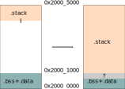
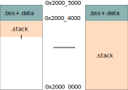

# `flip-link`

> adds zero-cost stack overflow protection to your embedded programs

## The problem

Bare metal Rust programs may *not* be memory safe in presence of stack overflows.
For example, this is the case for Rust programs based on v0.6.x of the `cortex-m-rt` crate.

The following program, which contains no `unsafe` code block, can run into *undefined behavior* if it reaches a stack overflow condition.

``` rust
// static variables placed in the .bss / .data sections
static FLAG1: AtomicBool = AtomicU32::new(false); // .bss
static FLAG2: AtomicBool = AtomicU32::new(true);  // .data

fn main() {
    let _x = fib(100);
}

#[inline(never)]
fn fib(n: u32) -> u32 {
    // allocate and initialize one kilobyte of stack memory
    let _use_stack = [0xAA; 1024];

    if n < 2 {
        1
    } else {
        fib(n - 1) + fib(n - 2) // recursion
    }
}

#[interrupt]
fn interrupt_handler() {
    // does some operation with `FLAG1` and `FLAG2`
}
```

The default memory layout of ARM Cortex-M programs in RAM is shown below.



The function call stack, also known as the "stack", grows downwards on function calls and when local variables (e.g. `let x`) are created (these variables are also placed on the stack).

If the stack grows too large it collides with the `.bss + .data` region, which contains all the program's static variables. The collision results in the static variables being overwritten with unrelated data. This can result in the program observing the static variables in an invalid state: for example an `AtomicBool` may hold the value `3` -- this is undefined behavior because the Rust ABI expects this single-byte variable to be either `0` or `1`.

## The solution

One potential solution is to change the memory layout of the program and place the stack *below* the `.bss+.data` region.

With this flipped memory layout (pictured below) the stack cannot collide with the static variables. Instead it will collide with the boundary of the physical RAM memory region. In the ARM Cortex-M architecture, trying to read or write pass the boundaries of the RAM region produces a "hardware exception". The `cortex-m-rt` crate provides an API to handle this condition: a `HardFault` exception handler can be defined; this "handler" (function) will be executed when the invalid memory operation is attempted.



`flip-link` implements this stack overflow solution. Linking your program with `flip-link` produces the flipped memory layout, which is memory safe in presence of stack overflows.

## Architecture support

`flip-link` is known to work with ARM Cortex-M programs that link to version `0.6.x` of the [`cortex-m-rt`] crate and are linked using the linker shipped with the Rust toolchain (LLD).
At this time, it hasn't been tested with other architectures or runtime crates.

[`cortex-m-rt`]: https://crates.io/crates/cortex-m-rt

## Installation

`flip-link` is available on [crates.io]. To install it, run

[crates.io]: https://crates.io/crates/flip-link

```console
$ cargo install flip-link
```

## Usage

Change the linker from `rust-lld` (the default) to `flip-link` in `.cargo/config.toml`

``` toml
[target.'cfg(all(target_arch = "arm", target_os = "none"))']
# (..)
rustflags = [
  "-C", "linker=flip-link", # <- add this
  # (..)
]
```

NOTE that if you were using GNU `ld` or GNU `gcc` to link your program then this
won't work. Support for other linkers is being tracked in [issue #1]

[issue #1]: https://github.com/knurling-rs/flip-link/issues/1

## Support

`flip-link` is part of the [Knurling] project, [Ferrous Systems]' effort at
improving tooling used to develop for embedded systems.

If you think that our work is useful, consider sponsoring it via [GitHub
Sponsors].

## License

Licensed under either of

- Apache License, Version 2.0 ([LICENSE-APACHE](LICENSE-APACHE) or
  http://www.apache.org/licenses/LICENSE-2.0)

- MIT license ([LICENSE-MIT](LICENSE-MIT) or http://opensource.org/licenses/MIT)

at your option.

### Contribution

Unless you explicitly state otherwise, any contribution intentionally submitted
for inclusion in the work by you, as defined in the Apache-2.0 license, shall be
licensed as above, without any additional terms or conditions.

[Knurling]: https://knurling.ferrous-systems.com
[Ferrous Systems]: https://ferrous-systems.com/
[GitHub Sponsors]: https://github.com/sponsors/knurling-rs
